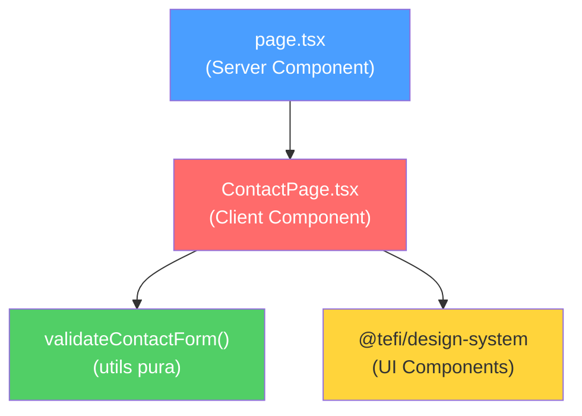

# Análisis de la Ruta `/contact`

## Estructura de Archivos

```
app/contact/
├── page.tsx                          ← Server Component (entry point)
├── ui/
│   └── contact-page/
│       └── ContactPage.tsx           ← Client Component (416 líneas)
└── utils/
    └── validate-contact-form.ts      ← Lógica de validación pura (68 líneas)
```

## Componentes del Design System Utilizados

| Componente | Uso |
|---|---|
| `Card`, `Card.Header`, `Card.Body` | Contenedor principal del formulario |
| `Form`, `FormField` | Estructura semántica del formulario |
| `Input`, `Textarea` | Campos de texto |
| `Label`, `ErrorMessage` | Etiquetas y mensajes de error |
| `Radio`, `RadioGroup` | Selector de método de contacto |
| `Button` | Botón de envío |
| `Heading`, `Text` | Tipografía |
| `Container`, `Section`, `Stack` | Layout |

## Componentes Disponibles NO Utilizados

Estos componentes del design system podrían enriquecer la página:

| Componente | Uso potencial |
|---|---|
| `Icon` | Iconos en labels, botones, feedback |
| `Spinner` | Indicador de carga durante envío |
| `Divider` | Separar secciones del formulario |
| `Chip` | Tags de estado (enviado, error) |
| `Skeleton` | Loading state del formulario |
| `Box` | Contenedores con estilos de fondo |
| `Inline` | Layout horizontal para campos |
| `FormRow` | Agrupar campos en fila |
| `FormSection` | Seccionar formulario visualmente |
| `FormActions` | Contenedor semántico para botones |
| `HelperText` | Texto de ayuda bajo campos |

---

## Arquitectura Actual



---

## Lo que Funciona Bien ✅

### 1. Separación de responsabilidades
- `page.tsx` es un **Server Component** limpio que solo renderiza `<ContactPage />`
- La validación está **extraída** en `utils/validate-contact-form.ts` como función pura
- El componente UI está **aislado** en su propia carpeta

### 2. Validación robusta
- Valida nombre, método de contacto, email/teléfono y mensaje
- Usa **regex** para email (`/^[^\s@]+@[^\s@]+\.[^\s@]+$/`) y teléfono (`/^\+?[0-9\s()-]{8,}$/`)
- Los tipos `ContactFormData` y `ContactFormErrors` están bien definidos con TypeScript

### 3. UX del formulario
- **Validación en tiempo real** después del primer submit (`hasSubmitted` gate)
- **Campos condicionales**: muestra email o teléfono según el `RadioGroup`
- **Limpieza inteligente**: al cambiar método de contacto, limpia el campo opuesto
- Estados de **submitting**, **submitted** y **error** bien separados

### 4. Uso correcto del Design System
- Usa `FormField` con prop `state` para control de errores
- `noValidate` en el `Form` para manejar validación custom
- Componentes del design system usados consistentemente

---

## Problemas Identificados 🔴

### 1. Sin submit real — solo `setTimeout` simulado
```typescript
// Líneas 156-171: El envío es falso
setTimeout(() => {
  setIsSubmitting(false);
  if (formData.name.trim().toLowerCase() === "error") {
    setSubmitError("No pudimos enviar tu mensaje...");
    return;
  }
  setIsSubmitted(true);
}, 1000);
```
> El formulario no envía datos a ningún lado. Solo simula un delay de 1 segundo.

### 2. Sin Server Action
- El formulario usa `onSubmit` client-side exclusivamente
- No aprovecha **Server Actions** de Next.js para el envío
- No hay integración con ningún servicio de email/backend

### 3. No resetea el formulario después de éxito
- Tras enviar exitosamente, el formulario muestra "✓ Mensaje enviado" pero los campos **quedan con los valores** previos

### 4. Sin feedback visual de loading adecuado
- El botón cambia texto a "Enviando..." pero no usa el componente `Spinner` disponible en el design system
- No hay **disabled state visual** en los campos durante el envío

### 5. Mensajes de éxito/error con estilos inline
```typescript
// Líneas 387-394: Estilos hardcodeados
<Text style={{ color: "var(--state-success-text)", textAlign: "right" }}>
  ✓ Mensaje enviado correctamente.
</Text>
```
> Usa `style={{}}` inline en lugar de componentes del design system como `Chip` o un componente de feedback dedicado

### 6. Componente monolítico (416 líneas)
- `ContactPage.tsx` maneja **todo**: estado, validación, render, feedback
- Podría beneficiarse de un custom hook para la lógica del formulario

### 7. Sin metadata SEO
- [page.tsx](file:///home/david/Escritorio/daravena/daravena-app/daravena/app/contact/page.tsx) no exporta `metadata` ni usa `generateMetadata`

### 8. Sin `loading.tsx` ni `error.tsx`
- La ruta no tiene archivos de loading/error de Next.js

---

## Propuestas de Mejora 🚀

### Nivel 1 — Quick wins (sin cambiar funcionalidad)

| # | Mejora | Impacto |
|---|---|---|
| 1 | Agregar `export const metadata` en `page.tsx` con título y descripción | SEO |
| 2 | Resetear formulario tras envío exitoso | UX |
| 3 | Usar `Spinner` en el botón de envío | UX visual |
| 4 | Reemplazar estilos inline de éxito/error con componentes del DS | Consistencia |
| 5 | Agregar `HelperText` a campos (ej: formato de teléfono esperado) | Accesibilidad |
| 6 | Usar `FormActions` para el botón submit | Semántica |
| 7 | Agregar `Icon` a labels y al botón | Visual |

### Nivel 2 — Refactoring estructural

| # | Mejora | Impacto |
|---|---|---|
| 8 | Extraer un hook `useContactForm()` con toda la lógica de estado | Mantenibilidad |
| 9 | Separar el formulario en sub-componentes más pequeños | Legibilidad |
| 10 | Agregar `loading.tsx` y `error.tsx` | Robustez |

### Nivel 3 — Funcionalidad real

| # | Mejora | Impacto |
|---|---|---|
| 11 | Implementar un **Server Action** para enviar el formulario | Funcional |
| 12 | Integrar un servicio de email (Resend, SendGrid, etc.) | Funcional |
| 13 | Agregar rate limiting y protección anti-spam | Seguridad |
| 14 | Guardar mensajes en Firestore como backup | Persistencia |

---

## Dependencias Actuales del Proyecto

- **`@tefi/design-system@0.4.46`** — Design system propio con 30+ componentes
- **`next@14.2.3`** — Framework (App Router)
- **`react@18`** — UI library
- **`react-markdown`** + **`remark-gfm`** — Para la ruta markdown-test

> [!IMPORTANT]
> La prioridad más alta debería ser decidir **cómo quieres manejar el envío real del formulario** (Server Action + servicio de email), ya que eso define la arquitectura del resto de mejoras.
